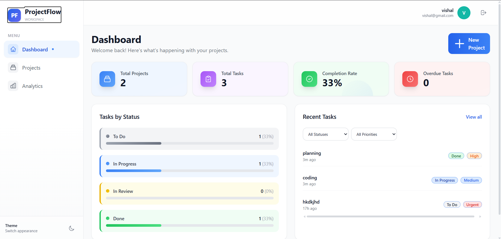
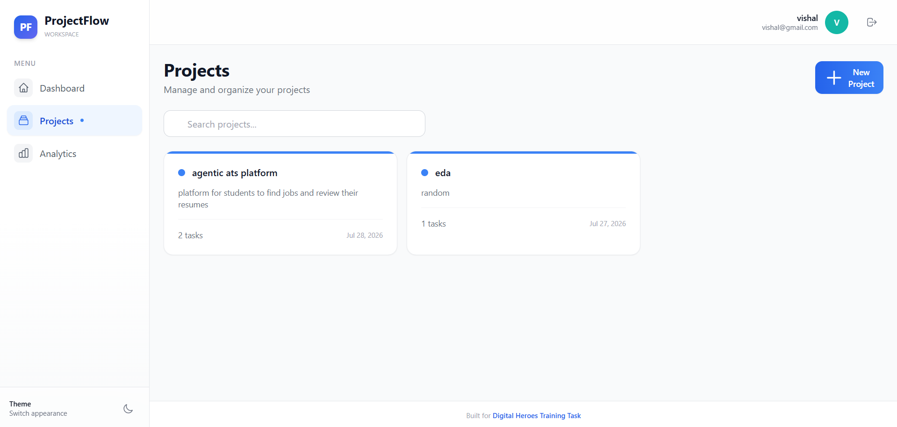
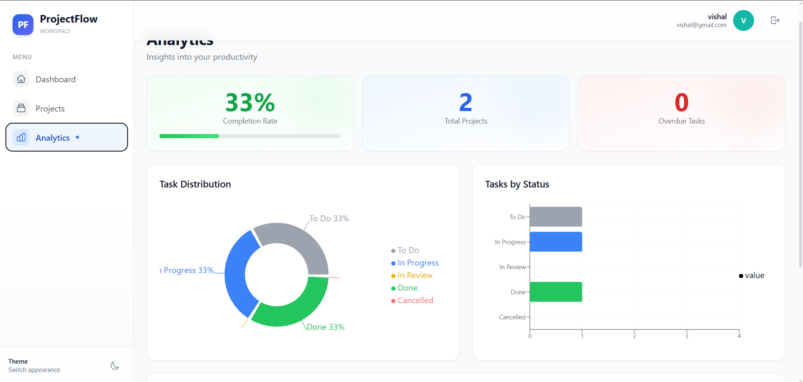
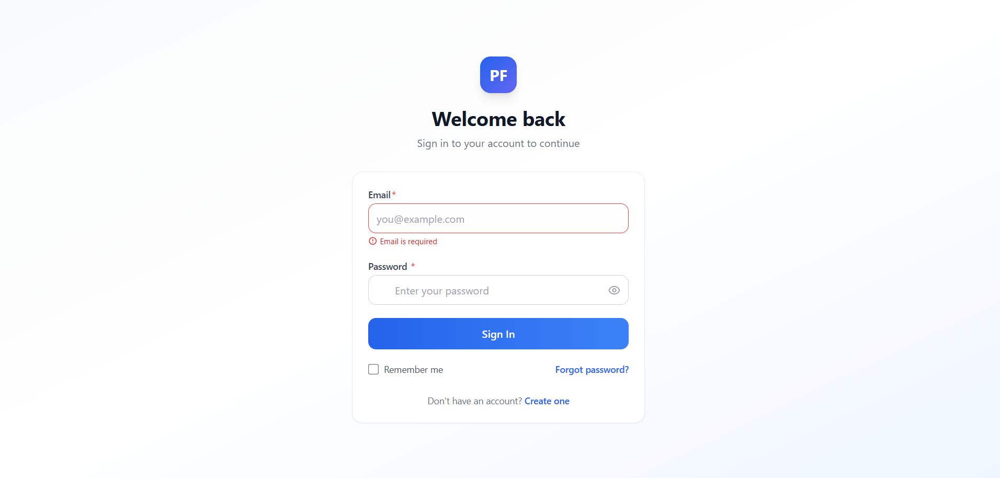
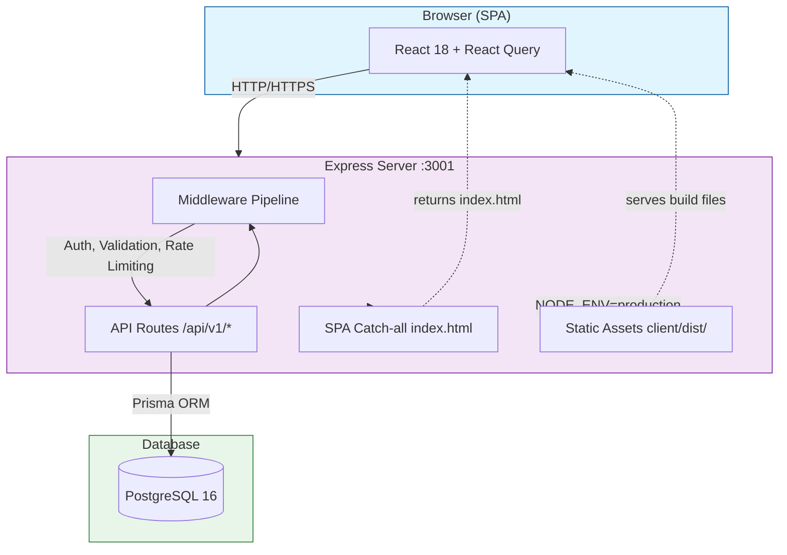

# ProjectFlow

A production-grade Task & Project Management Platform with Analytics, built with React, Express.js, TypeScript, PostgreSQL, and Prisma.

> **Live Demo:** [https://projectflow-nk0s.onrender.com](https://projectflow-nk0s.onrender.com)

---

## Screenshots

<table>
  <tr>
    <td></td>
    <td></td>
  </tr>
  <tr>
    <td><em>Dashboard with stats cards, status breakdown, and recent tasks</em></td>
    <td><em>Project cards with color coding and search</em></td>
  </tr>
  <tr>
    <td></td>
    <td></td>
  </tr>
  <tr>
    <td><em>Analytics with charts, priority breakdown, and activity feed</em></td>
    <td><em>Login with gradient UI and password toggle</em></td>
  </tr>
</table>

---

## Architecture Overview



### Key Design Decisions

- **Single-service deployment** -- Express serves both the REST API and the built SPA. No separate frontend server.
- **Modular Architecture** -- Each domain (auth, projects, tasks, comments, analytics) is self-contained with routes, controller, service, and schema.
- **Type Safety** -- End-to-end TypeScript with Zod validation on all inputs.
- **Optimistic UI** -- React Query handles caching, refetching, and optimistic updates.

> See full architecture diagrams (request lifecycle, auth flow, ERD, module graph, deployment) in [`docs/architecture.md`](docs/architecture.md).

---

## Tech Stack

| Layer | Technology |
|-------|-----------|
| Runtime | Node.js 22 + TypeScript |
| Backend | Express.js 4 |
| ORM | Prisma 6 |
| Database | PostgreSQL 16 |
| Validation | Zod |
| Auth | JWT (access + refresh tokens) + bcrypt |
| Logging | Pino (structured JSON) |
| Security | Helmet, CORS, rate limiting |
| Frontend | React 18 + TypeScript + Vite |
| Styling | Tailwind CSS |
| State | TanStack React Query |
| Charts | Recharts |

---

## API Overview

**Base URL:** `http://localhost:3001` (dev) or production domain
**Auth:** `Authorization: Bearer <accessToken>`

### Quick Example -- Login

```bash
curl -X POST http://localhost:3001/api/v1/auth/login \
  -H "Content-Type: application/json" \
  -d '{"email":"demo@projectflow.com","password":"password123"}'
```

```json
{
  "success": true,
  "data": {
    "accessToken": "eyJhbG...",
    "refreshToken": "eyJhbG...",
    "user": { "id": "...", "name": "Demo User", "email": "demo@projectflow.com" }
  }
}
```

### All 25 Endpoints

| Module | Endpoints |
|--------|-----------|
| Health | `GET /health`, `/health/live`, `/health/ready` |
| Auth | `POST /register`, `/login`, `/refresh`, `GET /me` |
| Projects | `GET /projects`, `POST`, `GET /:id`, `PUT /:id`, `DELETE /:id` |
| Tasks | `GET /tasks/project/:projectId`, `POST`, `GET /:id`, `PUT /:id`, `PATCH /:id/status`, `DELETE /:id` |
| Comments | `GET /comments/task/:taskId`, `POST`, `DELETE /:id` |
| Analytics | `GET /analytics/overview`, `/analytics/projects/:id`, `/analytics/activity` |

> Full request/response schemas, error codes, and pagination docs: [`docs/api.md`](docs/api.md)

---

## Directory Structure

```
project/
├── server/          Express.js REST API (TypeScript)
│   ├── src/
│   │   ├── config/       Environment validation, constants
│   │   ├── errors/       Custom error class hierarchy
│   │   ├── lib/          Prisma client singleton
│   │   ├── middleware/    Auth, validation, logging, rate limiting, error handling
│   │   ├── modules/      Domain modules (auth, projects, tasks, comments, analytics)
│   │   ├── types/        TypeScript interfaces and augmentations
│   │   └── utils/        Logger, JWT, password hashing, pagination, query builder
│   ├── prisma/           Schema, migrations, seed
│   └── tests/            Integration tests
├── client/          React SPA (TypeScript, Vite, Tailwind)
│   └── src/
│       ├── api/          Axios client + API modules
│       ├── components/   Reusable UI and domain components
│       ├── hooks/        React Query hooks
│       ├── lib/          Auth helpers, utility functions
│       ├── pages/        Route-level page components
│       └── types/        Shared TypeScript types
├── docker/          Dockerfile for unified single-service build
├── docs/            API reference and architecture documentation
├── screenshots/     Application screenshots
├── .github/         CI/CD workflow
└── docker-compose.yml
```

---

## Getting Started

### Prerequisites

- Node.js 22+
- PostgreSQL 16+ (or Docker)
- npm 10+

### Development

```bash
cd project
npm install

# Start PostgreSQL (Docker)
docker compose up -d postgres

# Configure environment
cp .env.example server/.env
# Edit server/.env with your values

# Run migrations and seed
npm run db:migrate -w server
npm run db:seed -w server

# Start both servers
npm run dev
```

The API runs on `http://localhost:3001` and the Vite dev server on `http://localhost:5173`.

### Docker (Production-like)

```bash
docker compose up --build
```

This starts:
- **PostgreSQL** on `:5432`
- **Unified server** (API + SPA) on `:3001`

Open `http://localhost:3001` -- the SPA and API are served from the same origin.

Seed the database:
```bash
docker compose exec server npx prisma db seed --schema=server/prisma/schema.prisma
```

Demo credentials: `demo@projectflow.com` / `password123`

---

## Environment Variables

| Variable | Default | Description |
|----------|---------|-------------|
| `PORT` | `3001` | Server port |
| `NODE_ENV` | `development` | Environment mode |
| `DATABASE_URL` | -- | PostgreSQL connection string |
| `JWT_ACCESS_SECRET` | -- | Access token signing secret (min 16 chars) |
| `JWT_REFRESH_SECRET` | -- | Refresh token signing secret (min 16 chars) |
| `JWT_ACCESS_EXPIRY` | `15m` | Access token TTL |
| `JWT_REFRESH_EXPIRY` | `7d` | Refresh token TTL |
| `CORS_ORIGIN` | `http://localhost:5173` | Allowed CORS origin |
| `RATE_LIMIT_WINDOW_MS` | `900000` | Rate limit window (15 min) |
| `RATE_LIMIT_MAX_REQUESTS` | `100` | Max requests per window |

---

## Deployment

### Docker (Any Host)

```bash
docker compose up --build -d
```

Then seed (first time only):
```bash
docker compose exec server npx prisma db seed --schema=server/prisma/schema.prisma
```

### Render

Create a **Web Service** + **PostgreSQL** database on Render.

| Setting | Value |
|---------|-------|
| **Build Command** | `npm run render-build` |
| **Start Command** | `npm start` |

**Environment Variables:**

| Variable | Value |
|----------|-------|
| `DATABASE_URL` | Render PostgreSQL internal URL |
| `JWT_ACCESS_SECRET` | Random string (min 16 chars) |
| `JWT_REFRESH_SECRET` | Different random string (min 16 chars) |
| `NODE_ENV` | `production` |
| `PORT` | (Render sets automatically) |

After first deploy, run once:
```bash
npm run db:seed -w server
```

---

## Testing

```bash
# Run server tests (integration)
npm test

# Run with coverage
npm run test:coverage -w server

# Run client tests
npm run test:client

# Watch mode
npm run test:watch -w server
```

### Test Coverage

- Auth: registration, login, token refresh, validation
- Projects: CRUD, ownership, authorization
- Tasks: CRUD, status transitions, filtering, sorting
- Comments: CRUD, author-only deletion
- Analytics: overview, project analytics, activity feed
- Health endpoints and 404 handling

---

## Security

- bcrypt password hashing (12 rounds)
- JWT access tokens (15 min) + refresh tokens (7 days)
- Rate limiting (100 req/15min general, 10 req/15min auth)
- Helmet security headers
- CORS restricted to configured origin
- Input validation on all endpoints (Zod)
- Parameterized queries via Prisma (SQL injection prevention)
- No secrets in repository
- XSS protection via input sanitization

---

## Documentation

| File | What's Inside |
|------|---------------|
| [`docs/api.md`](docs/api.md) | All 25 endpoints, request/response schemas, error codes, rate limits, pagination |
| [`docs/architecture.md`](docs/architecture.md) | Mermaid diagrams: system architecture, request lifecycle, auth flow, ERD, module graph, deployment, CI/CD |

---

## AI Usage

AI was used extensively throughout the development of this project. Specifically: architecture design decisions (modular monolith pattern, single-service deployment), boilerplate generation for Express middleware pipeline, Prisma schema design, React component scaffolding, Zod validation schemas, JWT auth flow implementation, structured logging setup with Pino, Docker configuration, CI/CD pipeline, and documentation (API reference with all 25 endpoints, Mermaid architecture diagrams). Manual changes included: debugging deployment issues (trust proxy, runtime migrations, Neon PostgreSQL connectivity), UI/UX refinements (focus management, responsive layout, gradient design system), writing integration tests, and performance optimizations (useCallback, useMemo for React renders).

---

## Built for

Built for [Digital Heroes Training Task](https://digitalheroesco.com).

---

## License

ISC
