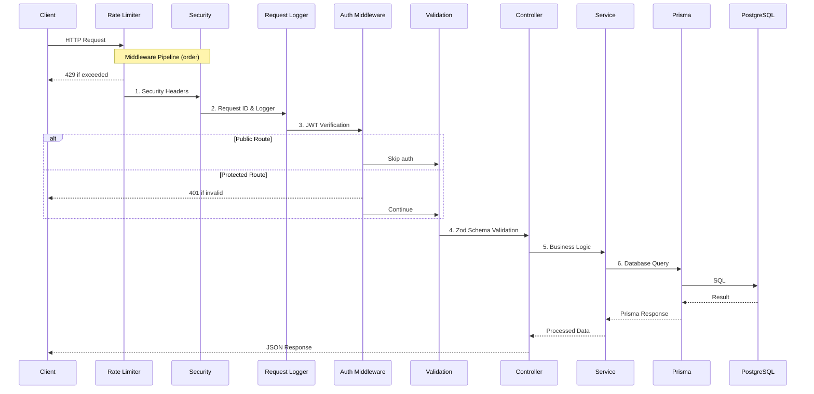
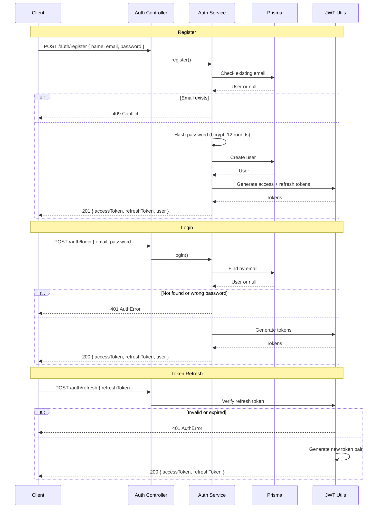
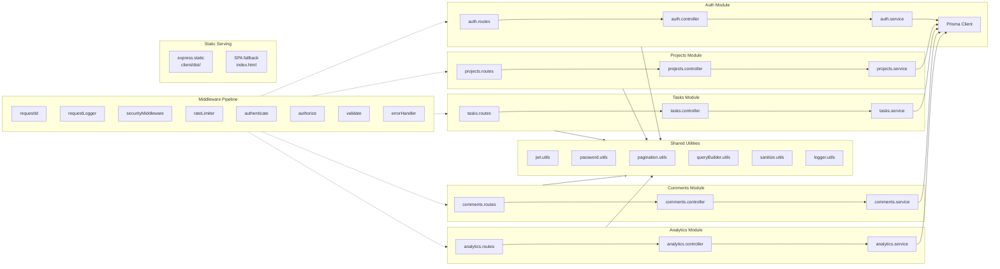
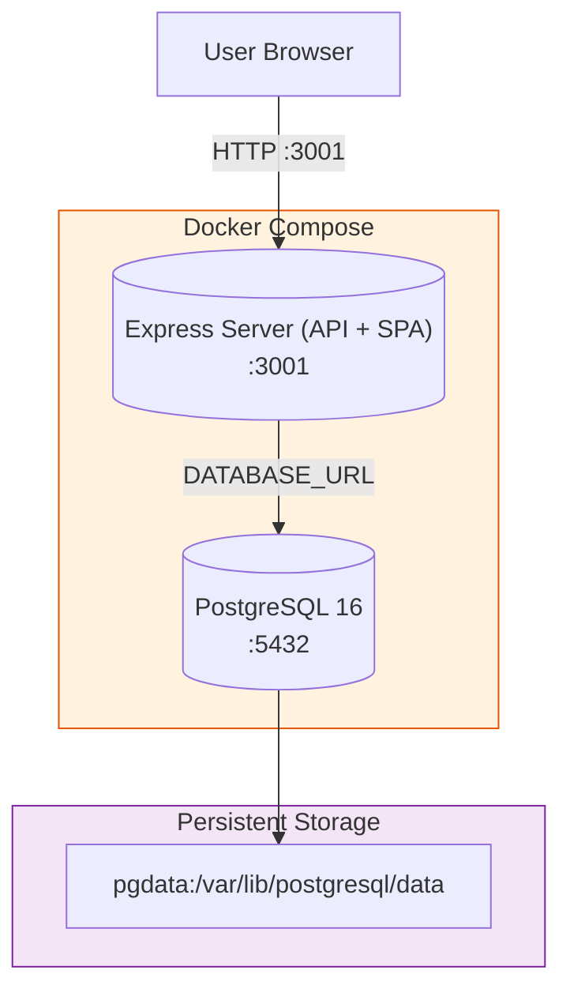
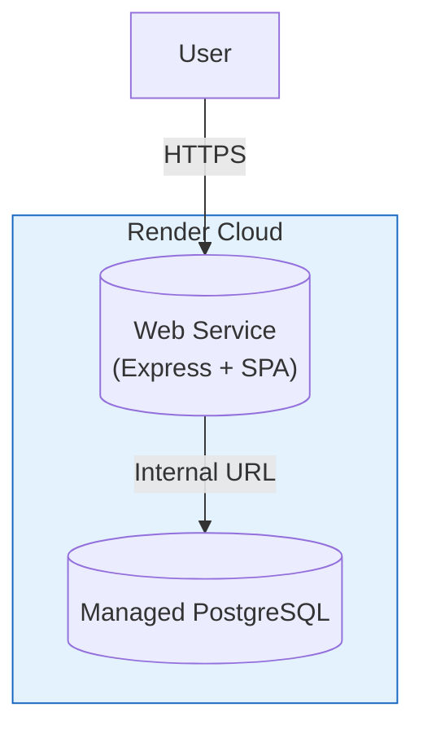

# ProjectFlow Architecture

## System Architecture

```mermaid
graph TB
    subgraph Client["Browser"]
        B[SPA (React)]
    end

    subgraph Server["Single Service (Docker/Render)"]
        S[Express Server<br/>:3001]
        M[Middleware Pipeline]
        API[API Routes<br/>/api/v1/*]
        STAT[Static Files<br/>client/dist/]
        SPA[SPA Catch-all<br/>index.html]
        R[Route Layer]
        C[Controllers]
        SV[Services]
        P[Prisma Client]
    end

    subgraph DB["Database"]
        PG[PostgreSQL 16<br/>:5432]
    end

    B -->|"GET /dashboard"| S
    B -->|"GET /api/v1/*"| S
    B -->|"GET /assets/*"| S

    S --> STAT
    S --> API
    S --> SPA

    API --> M
    M --> R --> C --> SV --> P
    P --> PG

    STAT -.->|serves build files| B
    SPA -.->|returns index.html| B

    style Client fill:#e1f5fe,stroke:#01579b
    style Server fill:#f3e5f5,stroke:#7b1fa2
    style DB fill:#e8f5e9,stroke:#2e7d32
```

**Request flow:**
1. Browser requests `GET /dashboard` → Express checks static files → not found → SPA catch-all returns `index.html`
2. React loads, renders Dashboard component
3. Dashboard makes `GET /api/v1/analytics/overview` → Express routes to API middleware → controller → service → Prisma → PostgreSQL
4. JSON response returned to SPA

---

## Request Lifecycle



---

## Authentication Flow



---

## Database ERD

```mermaid
erDiagram
    User ||--o{ Project : owns
    User ||--o{ Task : assigned
    User ||--o{ Comment : writes
    User ||--o{ Activity : generates
    Project ||--o{ Task : contains
    Task ||--o{ Comment : has
    Task ||--o{ Activity : logs

    User {
        uuid id PK
        string email UK
        string name
        string passwordHash
        string avatarUrl nullable
        datetime createdAt
        datetime updatedAt
    }

    Project {
        uuid id PK
        string name
        string description nullable
        string color "default #3B82F6"
        uuid ownerId FK
        datetime createdAt
        datetime updatedAt
    }

    Task {
        uuid id PK
        string title
        string description nullable
        enum status "TODO | IN_PROGRESS | IN_REVIEW | DONE | CANCELLED"
        enum priority "LOW | MEDIUM | HIGH | URGENT"
        datetime dueDate nullable
        uuid projectId FK
        uuid assigneeId FK nullable
        datetime completedAt nullable
        datetime createdAt
        datetime updatedAt
    }

    Comment {
        uuid id PK
        string content
        uuid taskId FK
        uuid authorId FK
        datetime createdAt
        datetime updatedAt
    }

    Activity {
        uuid id PK
        string action "created | updated | status_changed | completed | deleted"
        json details nullable
        uuid taskId FK
        uuid userId FK
        datetime createdAt
    }
```

---

## Module Architecture



---

## Deployment Architecture

### Docker (Two containers)



### Render (Single Web Service)



---

## CI/CD Pipeline


---

## Technology Stack

| Layer      | Technology                          |
|------------|-------------------------------------|
| Frontend   | React 18, TypeScript, Vite, Tailwind CSS, React Router 7, TanStack React Query, Recharts |
| Backend    | Node.js, Express 4, TypeScript, Prisma ORM, Zod Validation |
| Database   | PostgreSQL 16                       |
| Auth       | JWT (access + refresh tokens), bcrypt |
| Deployment | Docker Compose (2 containers) or Render single web service |
| CI/CD      | GitHub Actions                      |
| Testing    | Vitest, Supertest, Jest DOM         |

## Port Mapping

| Service       | Internal Port | External Port |
|---------------|---------------|---------------|
| Express (API + SPA) | 3001    | 3001          |
| PostgreSQL    | 5432          | 5432          |

In production (Render), the Express server uses port `10000` (set automatically) and is accessed via HTTPS on the default ports (443/80).
